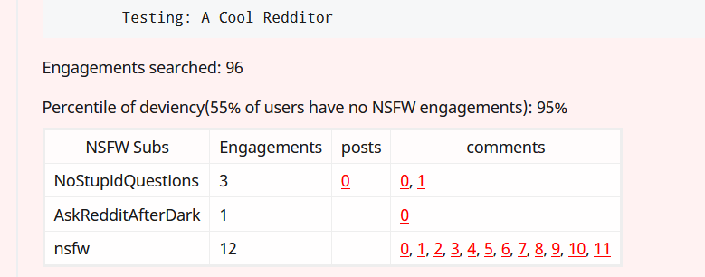

# Is_NSFW_Reddit_Bot

Detects if an account is NSFW. Intended to be used by platonic friend forums on Reddit to prevent malicious actors from infiltrating.

<h4>Description:</h4>

When the bot is deployed to a Reddit forum, it will scan all new comments. When a user responds to a comment or post with <em>is_nsfw?</em>, the bot will scan the last 100 engagements the parent comment/submission for activity labeled NSFW. The bot will return a table of all the flagged submissions, as well as deviancy score. The deviancy score is determined from data that was scraped from 692 randomly selected users. Data analysis and cleaning was done with Pandas, Seaborn, and Google Big Query

<h3>Technologies used</h3>
<ul>
    <li>
        Python
    </li>
    <li>
        SQL
    </li>
    <li>
        Google Big Query
    </li>
    <li>
        Jupyter Notebook
    </li>
    <li>
        Puppeteer
    </li>
    <li>
        JavaScript
    </li>
    <li>
        Reddit API
    </li>
    <li>
        Heroku
    </li>
</ul>

<h4><a href = "https://medium.com/@bbrenng1/create-your-first-reddit-bot-with-python-and-heroku-e75d7af3026f">Directions to deploy the bot.</a></h4>
<ol>
	<li>
		Create a Heroku account
	</li>
	<li>
		Install the Heroku command line tool
	</li>
	<li>
		Login to Heroku via the command line
	</li>
	<li>
		clone the git hub repository
	</li>
	<li>
		In main.py, change the trigger word to your preferred keyword. Change the default subreddit to your targetted sub-reddit.
	</li>
	<li>
		Deploy with the Heroku command line tool
	</li>
</ol>
